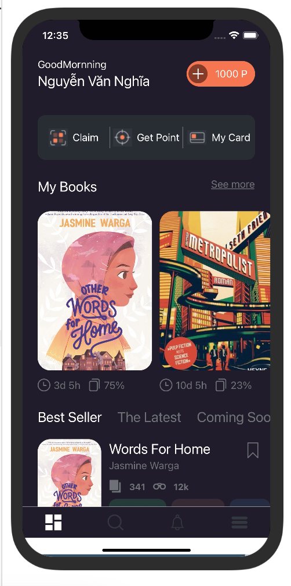
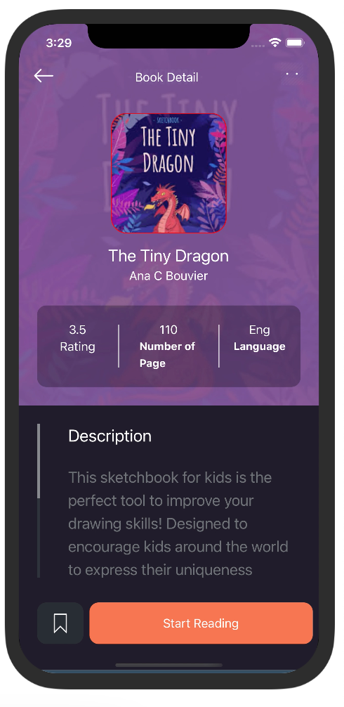

# Project shop book
> Design book shop interface like an online book reading app, you can click on any type of book and read it
### Installation && Usage
The application is run online on the website https://snack.expo.dev/ <br>
- Step 1: Create an expo account to run the app demo <br>
- Step 2: Choose the interface to demo as web, iphone .. or your personal phone
- Step 3: Click on the book you want to read and read it.
### View code in Screen
- HomeScreen
```php
 return (
    <SafeAreaView style={styles.container}>
      {/* Header Section */}
      <View style={styles.headerSession}>
        {renderHeader(profile)}
        {renderButtonSection()}
      </View>
      {/* Body Section */}

      <ScrollView style={styles.myBook}>
        {/* Body Section */}
        <View style={styles.bookContainer}>
          {renderMyBookSection(myBooks, navigation)}
        </View>
        {/* Categoryes Section */}
        <View style={styles.categorySetion}>{renderCategoryHeader()}</View>
        <View>{renderCategoryData()}</View>
      </ScrollView>
    </SafeAreaView>
  );
};
export default Home;
```
- BookDetail  (If there are books to be passed, then if . will be performed)
```php
 if (book) {
    return (
      <View style={styles.container}>
        <View style={styles.bookContainer}>{renderBookInfoSection()}</View>
        <View style={styles.descriptionContainer}>
          {renderBookDescription()}
        </View>
        <View style={styles.buttonContainer}>{renderBottomButton()}</View>
      </View>
    );
  } else {
    return <></>;
  }
```
## Result on completion
- Homepage results <br>



- BookDetail results <br>


- Demo UI Video <br>
[](https://www.youtube.com/watch?v=cUcFJQvaUNk "")


